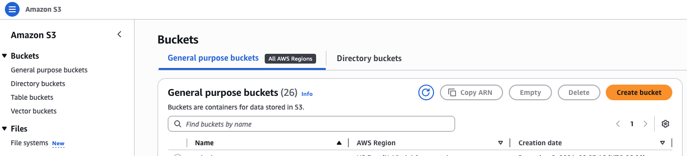
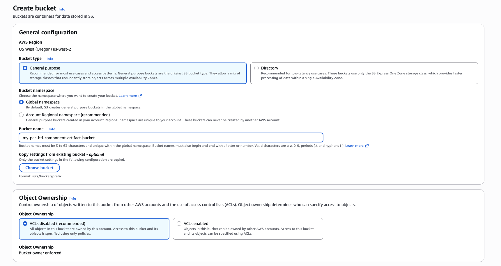
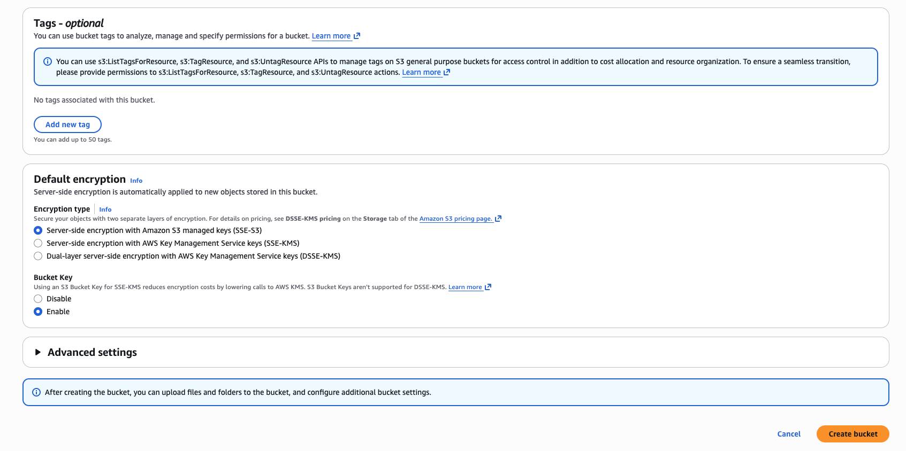
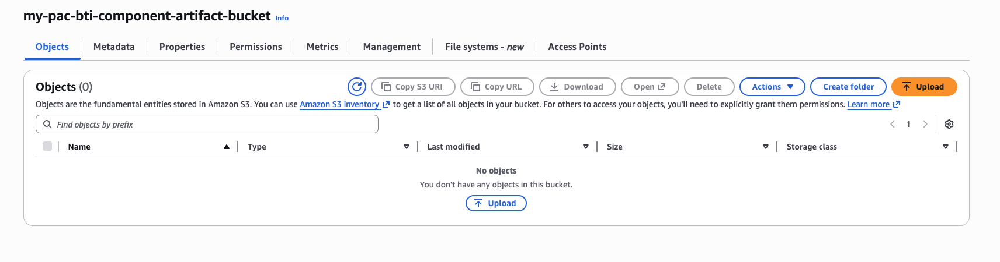
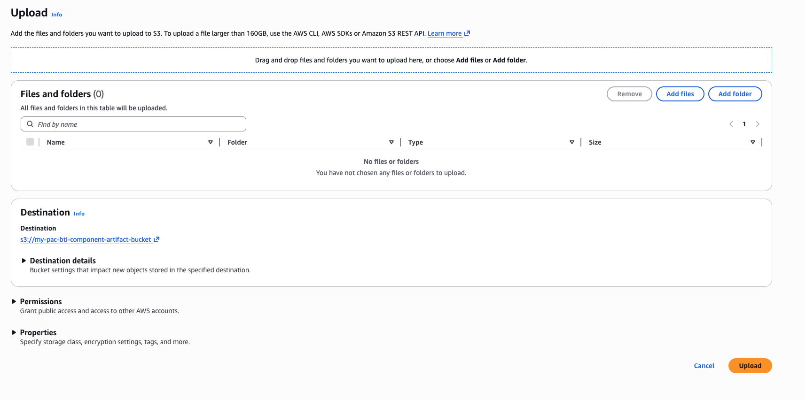
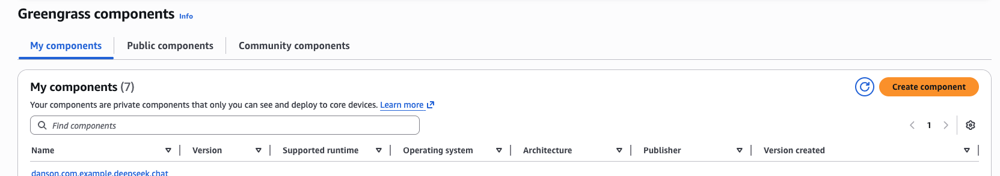
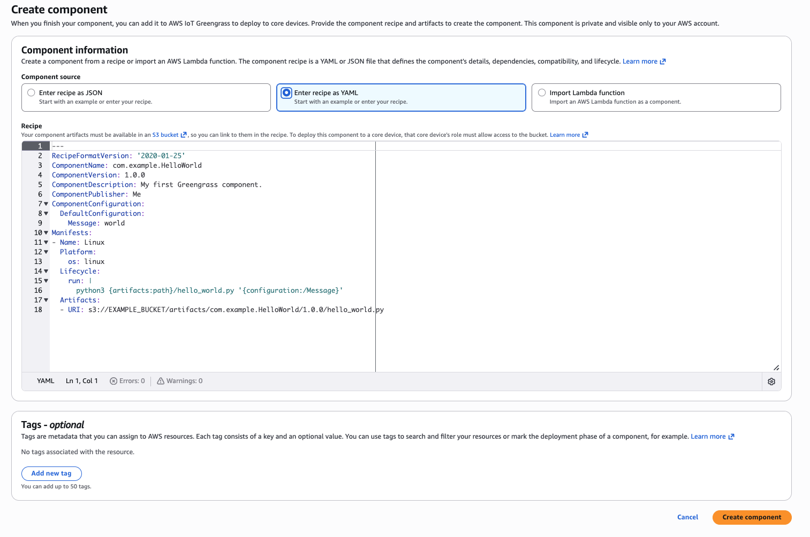
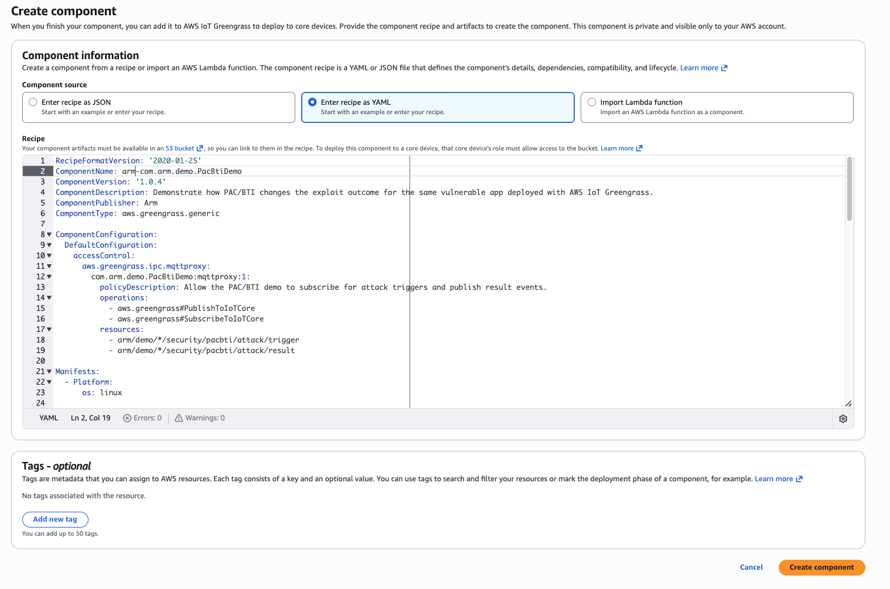
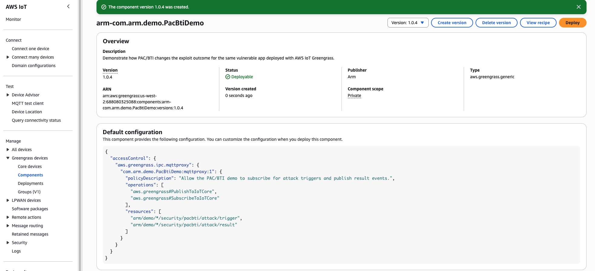

### Introduction

In this section, lets create a custom AWS IoT Greengrass component that will use a special "artifact" specified in the component to test for PAC/BTI presence in the Greengrass guests to which it is deployed to. 

### S3 bucket creation for the custom component artifact

1). In the AWS Console, Go to the S3 Console



2). Create a bucket and give it a name. Choose defaults for everything else. 



3). Press "Create bucket" 



4). Record the name of the bucket you created. You will need it in the next step when editing some YAML. 

6). Download/Save this artifact to your desktop:


5). Press "Upload" to upload your saved artifact to your s3 bucket:



6). Press "Add Files" and select the saved artifact on your desktop. Press "Upload"



Your custom component's artifact is now ready for reference/use by your custom component! Lets create that component now. 

### Custom component creation

1) Back at the AWS Console --> IoT Core --> Greengrass Devices, Select "Components" on the left. 

2). Select "Create component"



3). Select "Enter recipe as YAML" and clear the AWS editor with the default component sample yaml code



4). Copy and paste the following YAML into the AWS editor and press "Create component"..

{}
In the YAML code below, locate **YOUR_S3_BUCKET** and replace it with the actual S3 bucket name that you created in the previous step
{}


```yaml
RecipeFormatVersion: '2020-01-25'
ComponentName: arm-com.arm.demo.PacBtiDemo
ComponentVersion: '1.0.4'
ComponentDescription: Demonstrate how PAC/BTI changes the exploit outcome for the same vulnerable app deployed with AWS IoT Greengrass.
ComponentPublisher: Arm
ComponentType: aws.greengrass.generic

ComponentConfiguration:
  DefaultConfiguration:
    accessControl:
      aws.greengrass.ipc.mqttproxy:
        com.arm.demo.PacBtiDemo:mqttproxy:1:
          policyDescription: Allow the PAC/BTI demo to subscribe for attack triggers and publish result events.
          operations:
            - aws.greengrass#PublishToIoTCore
            - aws.greengrass#SubscribeToIoTCore
          resources:
            - arm/demo/*/security/pacbti/attack/trigger
            - arm/demo/*/security/pacbti/attack/result

Manifests:
  - Platform:
      os: linux

    Artifacts:
      - Uri: s3://YOUR_S3_BUCKET/arm-pac-bti-greengrass-demo-mqtt-trigger.zip
        Unarchive: ZIP
        Permission:
          Read: OWNER
          Execute: OWNER

    Lifecycle:
      Install:
        RequiresPrivilege: true
        Script: |-
          set -e

          PROJECT_ROOT="{artifacts:decompressedPath}/arm-pac-bti-greengrass-demo-mqtt-trigger/arm-pac-bti-greengrass-demo"
          WORK_DIR="{work:path}"
          VENV_DIR="{work:path}/venv"

          python3 -m venv "${VENV_DIR}"
          "${VENV_DIR}/bin/python" -m pip install --upgrade pip
          "${VENV_DIR}/bin/pip" install --no-cache-dir awsiotsdk

          bash "${PROJECT_ROOT}/greengrass/install.sh" \
            "${PROJECT_ROOT}" \
            "${WORK_DIR}"

      Run:
        Script: |-
          set -e

          PROJECT_ROOT="{artifacts:decompressedPath}/arm-pac-bti-greengrass-demo-mqtt-trigger/arm-pac-bti-greengrass-demo"
          WORK_DIR="{work:path}"
          VENV_DIR="{work:path}/venv"

          BUILD_FLAVOR="$(cat "${WORK_DIR}/state/selected_flavor")"
          BINARY="${WORK_DIR}/build/${BUILD_FLAVOR}/vuln_demo"
          OUTPUT_DIR="${WORK_DIR}/results"
          THING_NAME="{iot:thingName}"
          TRIGGER_TOPIC="arm/demo/${THING_NAME}/security/pacbti/attack/trigger"
          RESULT_TOPIC="arm/demo/${THING_NAME}/security/pacbti/attack/result"


          mkdir -p "${OUTPUT_DIR}"

          echo "THING_NAME=${THING_NAME}"
          echo "TRIGGER_TOPIC=${TRIGGER_TOPIC}"
          echo "RESULT_TOPIC=${RESULT_TOPIC}"

          if [ ! -x "${VENV_DIR}/bin/python" ]; then
            echo "Virtual environment Python not found at ${VENV_DIR}/bin/python"
            exit 1
          fi

          if [ ! -x "${BINARY}" ]; then
            echo "Binary not found or not executable: ${BINARY}"
            exit 1
          fi

          export PYTHONUNBUFFERED=1

          exec "${VENV_DIR}/bin/python" "${PROJECT_ROOT}/tools/demo_runner.py" \
            --project-root "${PROJECT_ROOT}" \
            --binary "${BINARY}" \
            --build-flavor "${BUILD_FLAVOR}" \
            --output-dir "${OUTPUT_DIR}" \
            --trigger-topic "${TRIGGER_TOPIC}" \
            --result-topic "${RESULT_TOPIC}"
```

5). Once entered press "Create component"



6). Your new custom component should now be registered and available



### What we've accomplished

Creating a custom AWS IoT Greengrass component is straightforward and simple.  Our PAC/BTI tester component is now created and available for deployment.  In the next section, we will deploy the custom component to our two Greengrass devices.