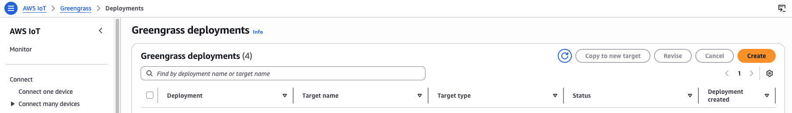
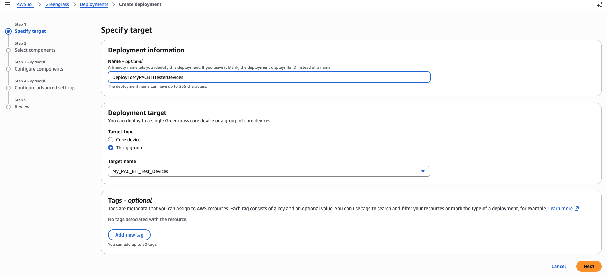
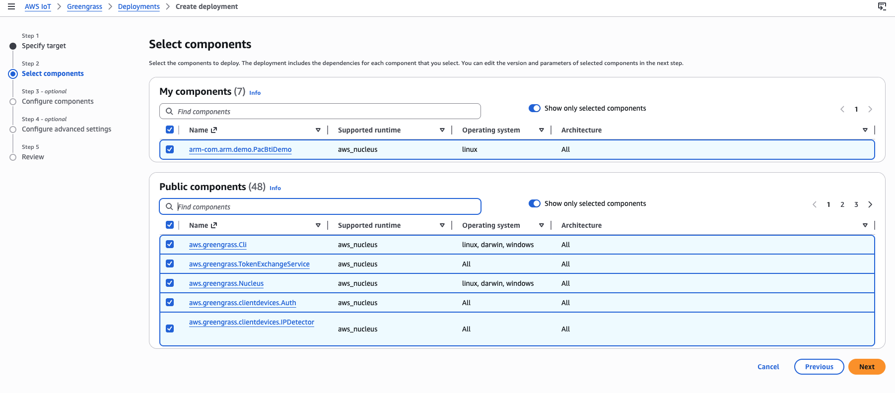
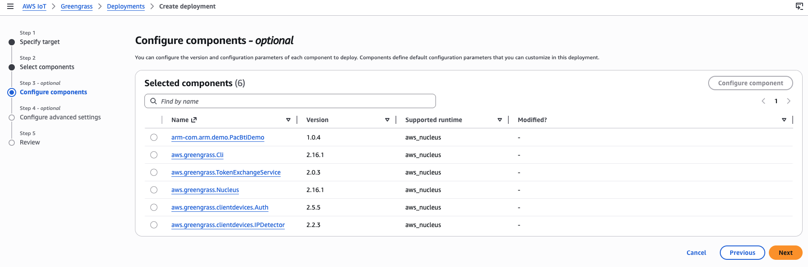
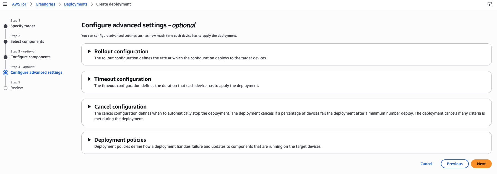
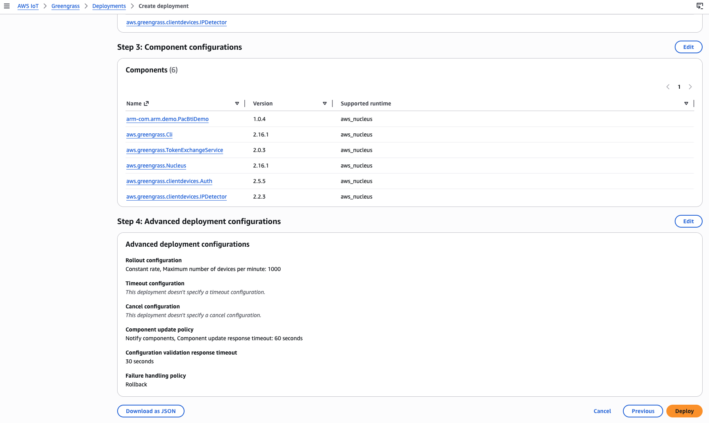
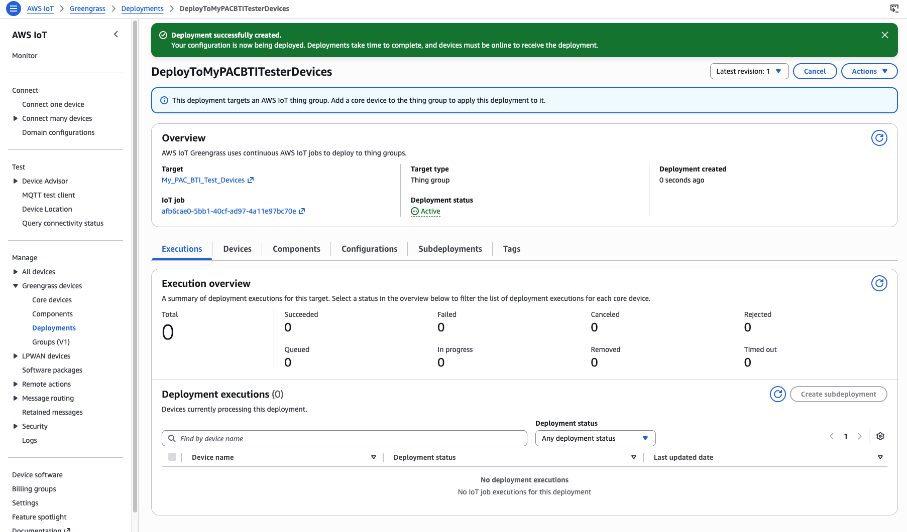

### Introduction

In this section, we will utilize the Greengrass grouping mechanism to perform a single deployment of a set of Greengrass components, including our PAC/BTI tester custom component, to both of our Greengrass devices. 

### Create Deployment

1. In the AWS Console --> IoT Core --> Greengrass --> Deployments, select "Create"

2). Name your deployment and select the Thing Group "My_PAC_BTI_Test_Devices". Press "Next":

3). Press "Next"

4). Press "Next"

5). Press "Next"

6). Scroll down and press press "Deploy"

7). Oncd deployed, Greengrass will install and prep your custom component in each of your PAC/BTI test devices (Thor and RPi5). Please wait until you have **2** succeeded in the "Execution Overview" section!

Once you have **2** successfully deployed, you are ready to run the PAC/BTI test on each of your devices!

### What we learned

In this section, we created a Greengrass deployment, targeting the IoTCore "Thing" group created when our two PAC/BTI tester devices were registered as Greengrass core devices. The deployment was run and the PAC/BTI custom component was installed per instructions provided by the YAML file specifying the component. 