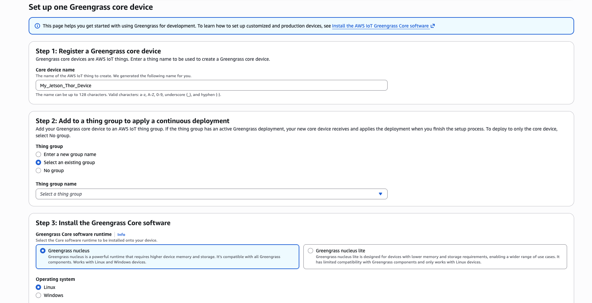
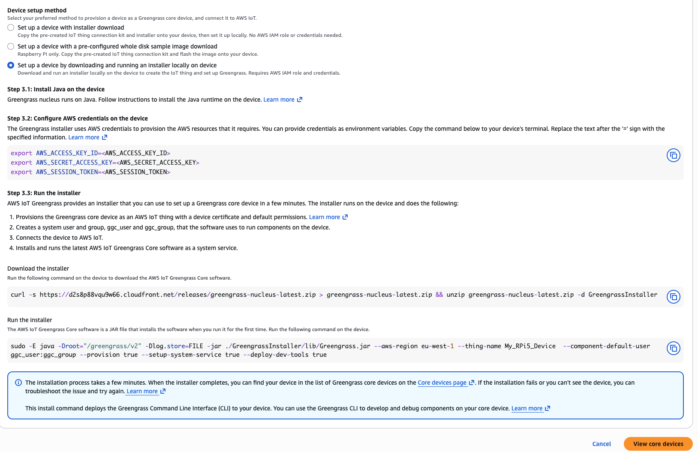

### Introduction

In this section, lets prepare a Jetson Thor device to become an AWS IoT Greengrass client. The Jetson Thor is chosen as a suitable Arm v9 platform where PAC/BTI instruction support DOES exist (this will serve as the "positive" check platform during our PAC/BTI test)

### Basic OS Install

Follow the instructions located in this video to install the latest NVidia Jetpack 7.1 onto your Jetson Thor device:  https://www.youtube.com/watch?v=IpiZyoqQTl8 


### Install Java

Open a terminal/shell into your RPi and type:

```bash
sudo apt update
sudo apt -y dist-upgrade
sudo apt install -y default-jdk
```

Confirm that java is available now:

```bash
java --version
```

Your output should resemble:

```output
openjdk 25.0.2 2026-01-20
OpenJDK Runtime Environment (build 25.0.2+10-Ubuntu-124.04)
OpenJDK 64-Bit Server VM (build 25.0.2+10-Ubuntu-124.04, mixed mode, sharing)
```

### Install AWS IoT Greengrass

Prior to completing these steps, you will need to create a set of AWS Credentials to use.  Please follow instructions outlined in this short video (or see your AWS administrator) to create them: https://www.youtube.com/watch?v=QzTkIfQNsVw 

1). Open your AWS Console and go to "IoT Core" --> "Greengrass Devices" --> "Core Devices"

2). Press "Setup core device" -> "Setup one core device"

3). Give your core device a name (make it DIFFERENT that your RPi5 device!)

4). Select "Select an existing group". Choose "My_PAC_BTI_Test_Devices" from the dropdown

5). Select to install "Greengrass Nucleus"

6). Select Linux



7). Select: "Set up a device by downloading and running an installer locally on device"

8). Follow the instructions provided to complete setting up your greengrass device. You will use your AWS credentials created above. 



9). Confirm that your device is now registered as a Greengrass device pressing "View core devices". You should see that your device is now registered and has recorded recent activity. 

### What's next

Your Jetson Thor is now setup as a AWS IoT Greengrass device! Next, lets create our custom AWS IoT Greengrass component that will test the availability of the PAC/BTI instructions on each of our Greengrass devices. 