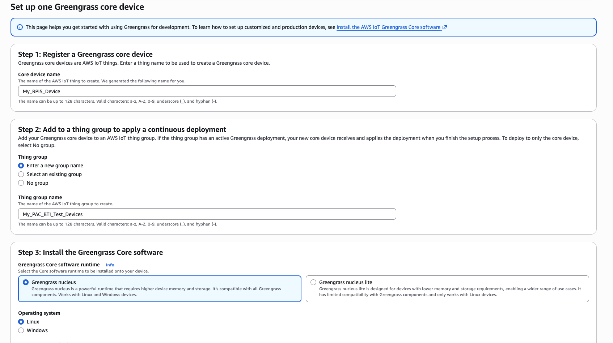

### Introduction

In this section, lets prepare a RPi5 device to become an AWS IoT Greengrass client. The RPi5 is chosen as a suitable Arm v8 platform where PAC/BTI instruction support does NOT exist (this will serve as the "negative" check platform during our PAC/BTI test)

### Basic OS Install

Follow the instructions located here to install the latest Raspberry Pi OS onto your RPi:  https://www.raspberrypi.com/documentation/computers/getting-started.html 


### Install Java

Open a terminal/shell into your RPi and type:

```bash
sudo apt update
sudo apt -y dist-upgrade
sudo apt install -y default-jdk
```

Confirm that java is available now:

```bash
java --version
```

Your output should resemble:

```output
openjdk 21.0.10 2026-01-20
OpenJDK Runtime Environment (build 21.0.10+7-Debian-1deb13u1)
OpenJDK 64-Bit Server VM (build 21.0.10+7-Debian-1deb13u1, mixed mode, sharing)
```

### Install AWS IoT Greengrass

Prior to completing these steps, you will need to create a set of AWS Credentials to use.  Please follow instructions outlined in this short video (or see your AWS administrator) to create them: https://www.youtube.com/watch?v=QzTkIfQNsVw 

1). Open your AWS Console and go to "IoT Core" --> "Greengrass Devices" --> "Core Devices"

2). Press "Setup core device" -> "Setup one core device"

3). Give your core device a name

4). Select "Enter a new group name".  In the group name, enter "My_PAC_BTI_Test_Devices". Save this group name as we'll use it when we create our "positive" device in the next section!

5). Select to install "Greengrass Nucleus"

6). Select Linux



7). Select: "Set up a device by downloading and running an installer locally on device"

8). Follow the instructions provided to complete setting up your greengrass device. You will use your AWS credentials created above. 


9). Confirm that your device is now registered as a Greengrass device pressing "View core devices". You should see that your device is now registered and has recorded recent activity. 

### What's next

Your RPi5 is now setup as a AWS IoT Greengrass device! Next, lets setup our "positive" PAC/BTI testing platform.