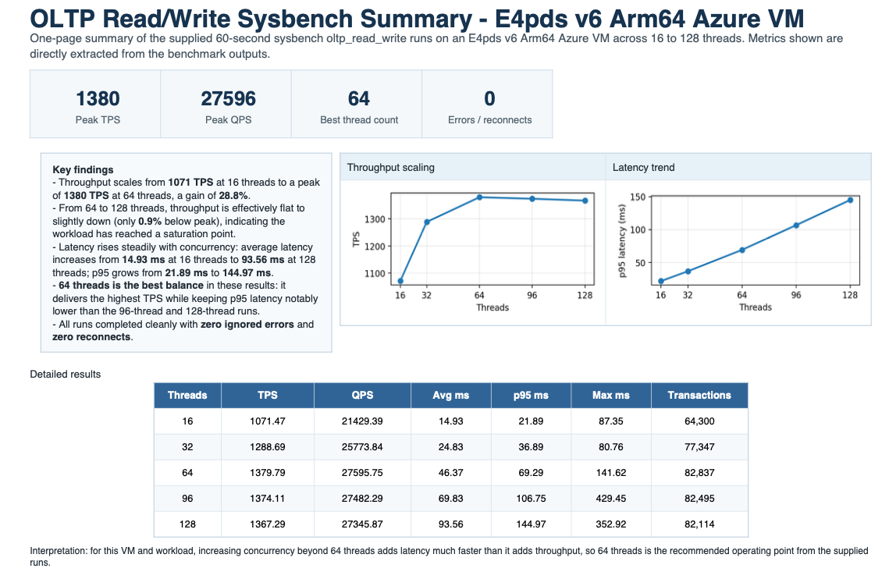

### Introduction

In this section, we'll run sysbench on our Azure Cloud MySQL instance to examine performance of the VM. We'll use the database that we migrated to the Azure Cloud instance for the basis of the benchmark. 


### Preparing to run the benchmark

Open **one SSH shell** into your "on-prem" instance replacing YOUR_RSA_FILENAME and YOUR_ONPREM_IP_ADDRESS from what you saved in the previous section:

```bash
ssh -i $HOME/.ssh/YOUR_RSA_FILENAME azureadmin@YOUR_ONPREM_IP_ADDRESS
```

Within the "on-prem" SSH shell, examine $HOME/.ssh for another "*rsa" file. Noting the name of that file and your Azure Cloud public IP address, open a shell from the "on-prem" shell into the Azure Cloud VM:

```bash
ssh -i $HOME/.ssh/AZURE_CLOUD_RSA_FILENAME azureadmin@YOUR_ARM_BASED_VM_PUBLIC_IP_ADDRESS
```

You should now have a SSH shell into your Arm-based Azure Cloud VM instance. 

Next, copy and save the following file as "run.sh" in the shell:

```bash
#!/bin/bash


run_bench() {
    THR=$1
    LENGTH=$2
    FILENAME=${PREFIX}_${THR}.perf
    if [ -f ${FILENAME} ]; then
        rm ${FILENAME}
    fi
    set -x
    sysbench /usr/share/sysbench/oltp_read_write.lua --table-size=1000000 --db-driver=mysql --mysql-db=testdb --mysql-user=${ADMIN} --mysql-password=${PW} --time=${LENGTH} --max-requests=0 --threads=${THR} run 2>&1 1>${FILENAME}
    set +x
}

main() {
  run_bench 16 60
  run_bench 32 60
  run_bench 64 60
  run_bench 96 60
  run_bench 128 60
}

export ADMIN=$1
export PW=$2
export PREFIX=$3
shift 3

main $*
```

Ensure that your script has execute privileges:

```bash
sudo chmod 755 ./run.sh
```

Also, within the shell, record the MySQL "admin" password for your Arm-based VM:

```bash
sudo su - 
cat /root/mysql_root_password.txt
```

### Running the benchmark

In the shell execute the run.sh script replacing AZURE_CLOUD_MYSQL_ADMIN_PW with the password from above (i.e. from cat /root/mysql_root_password.txt):

```bash
./run.sh admin AZURE_CLOUD_MYSQL_ADMIN_PW cobalt_100_arm64
```

The script will provide 5 output "perf" files that detail the performance of the sysbench "oltp_read_write" benchmark. 

### Interpreting the results

First, lets download the 5 "perf" benchmark files from the Azure VM.  From within the "on-prem" shell, type this replacing AZURE_CLOUD_RSA_FILENAME with the "rsa" file you found in your on-prem's home ssh directory (i.e. $HOME/.ssh) and YOUR_ARM_BASED_VM_PUBLIC_IP_ADDRESS with the public IP address of your Azure Arm64 VM:

```bash
cd $HOME
scp -i $HOME/.ssh/AZURE_CLOUD_RSA_FILENAME azureadmin@YOUR_ARM_BASED_VM_PUBLIC_IP_ADDRESS:*.perf .
```

Next, on your local host, type the following replacing ON_PREM_RSA_FILENAME with the "rsa" file you downloaded when you created the "on-prem" VM and YOUR_ON_PREM_SIM_IP_ADDRESS with the public IP address of your "on-prem" VM:

```bash
cd $HOME
scp -i $HOME/.ssh/ON_PREM_RSA_FILENAME azureuser@YOUR_ON_PREM_SIM_IP_ADDRESS:*.perf .
```

You should now have 5 "perf" files on your local host. These files can be used to investigate the perforance of your current Arm64 Azure Cloud VM. 

As an example, you can use ChatGPT to interpet and summarize the results by uploading all 5 perf files to ChatGPT and provide it with the following prompt:

```text
Please create a nice 1 page PDF summary of the performance results of the oltp_read_write sysbench benchmark running on E4pds_v6 Arm64 Azure VM . Supply tables, findings, and summaries in the PDF as a nice easy to read 1 pager.
```

ChatGPT will produce a nice summary to view your Arm64-based Cobalt 100 Azure Cloud VM's MySQL performance:



### What we learned

We learned how to:
- Utilize Terraform scripting to create an Arm-based Azure Cloud VM and "lift-n-shift" a MySQL database into that VM from a simulated x64 "on-prem" MySQL server. 
- Utilize sysbench, on the Arm-based Azure Cloud VM, to gauge the performance of the VM with the MySQL database.
- Utilize ChatGPT to create a nice simple summary of that performance from the sysbench "perf" files.